# Microservices Project – CI/CD DevSecOps on AWS EKS

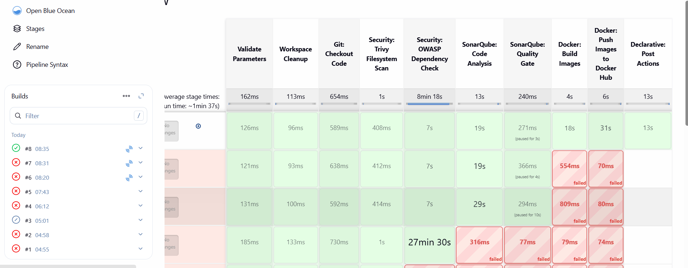
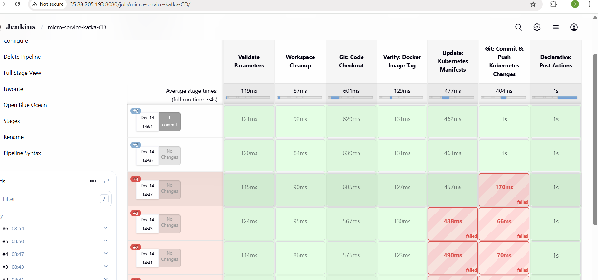
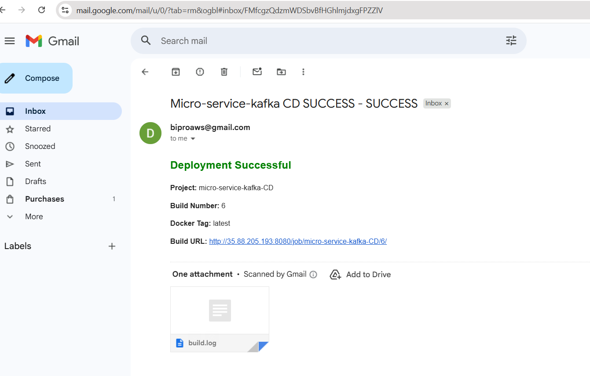
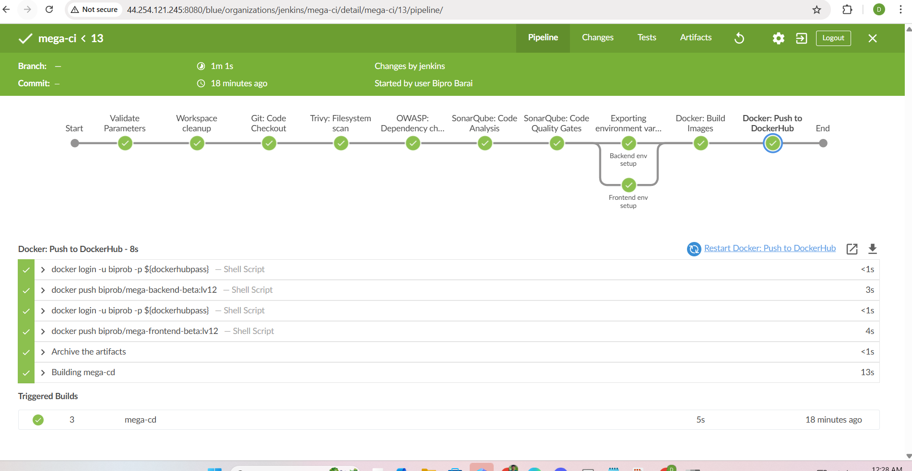
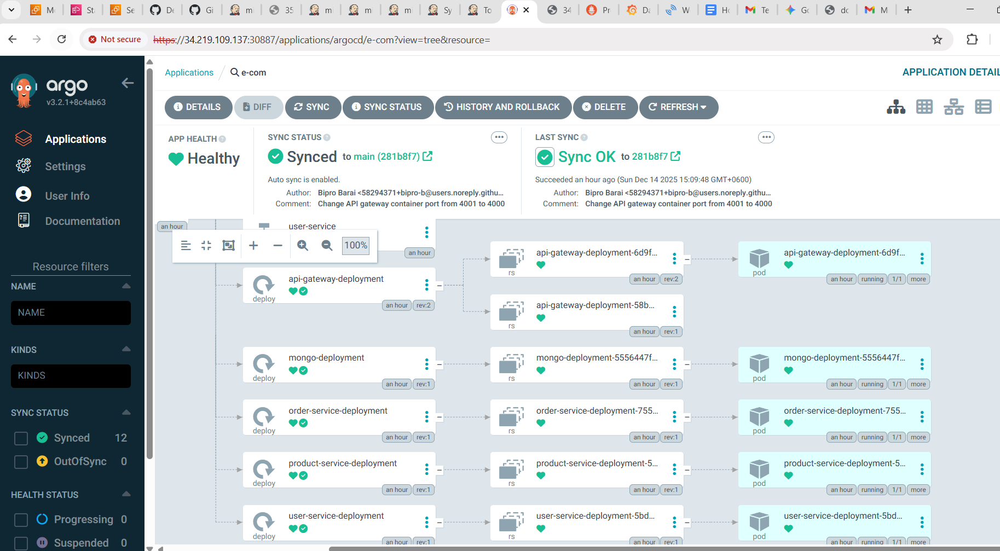
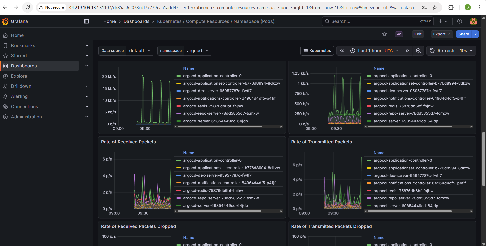
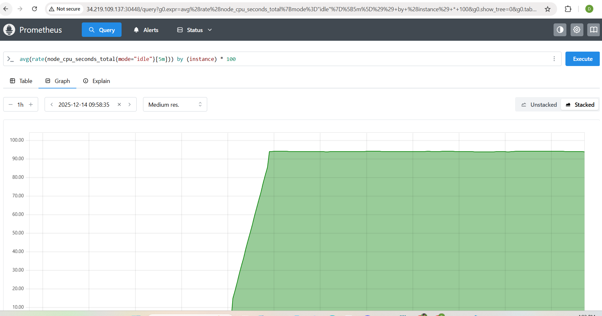
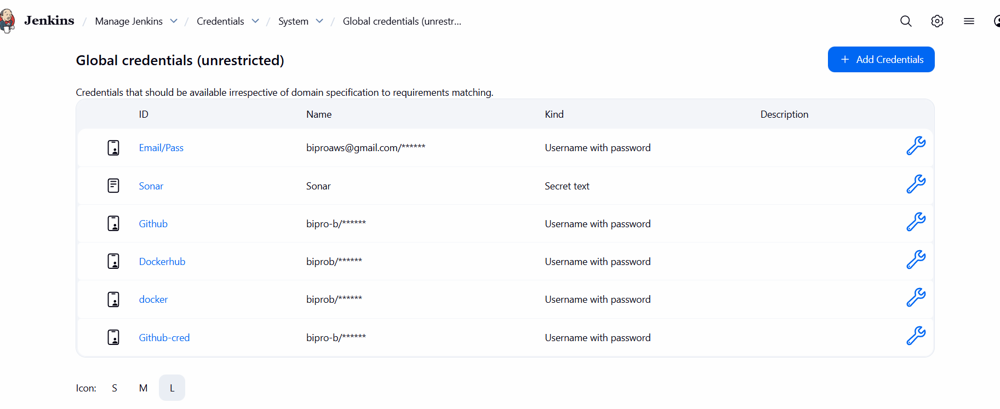

## Custom Grafana Dashboard

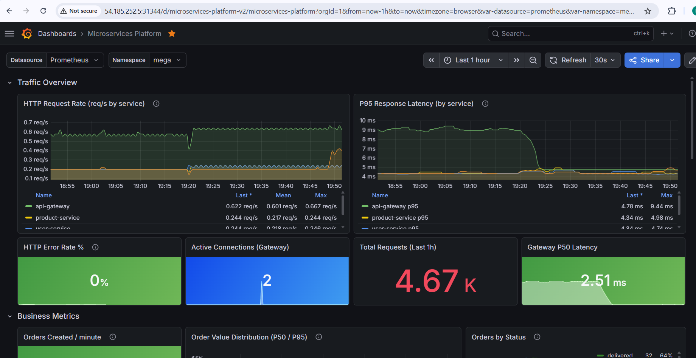
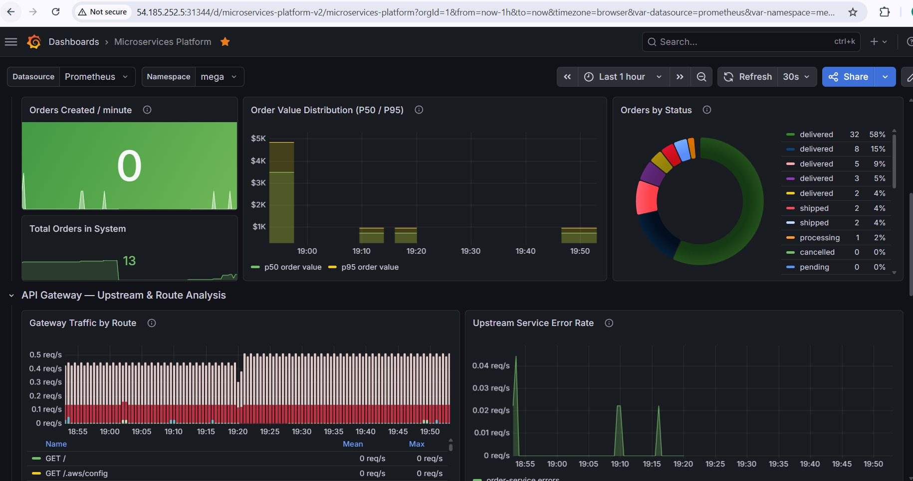
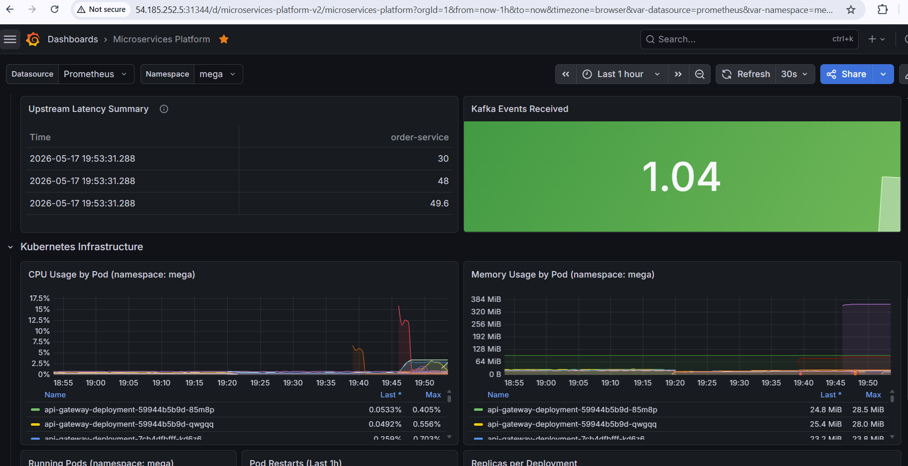
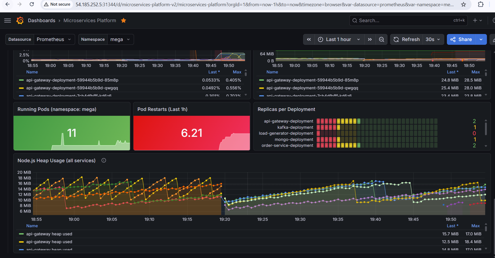

---

## Tech Stack

| Tool | Purpose |
|------|---------|
| Node.js | Microservices runtime |
| Kafka | Message broker |
| Docker | Containerization |
| Jenkins | CI Pipeline |
| ArgoCD | CD Pipeline (GitOps) |
| OWASP Dependency-Check | Dependency vulnerability scanning |
| SonarQube | Code quality & static analysis |
| Trivy | Filesystem security scan |
| AWS EKS | Kubernetes cluster |
| AWS ALB | Application Load Balancer (Ingress) |
| Helm | Kubernetes package manager + monitoring |
| Prometheus + Grafana | Cluster monitoring |

---

## Architecture Overview

```
Developer Push
      │
      ▼
Jenkins CI Pipeline
  ├── Trivy Filesystem Scan
  ├── OWASP Dependency Check
  ├── SonarQube Analysis + Quality Gate
  ├── Docker Build (4 services)
  ├── Docker Push to DockerHub
  └── Trigger CD Pipeline
      │
      ▼
Jenkins CD Pipeline (GitOps)
  ├── Update Kubernetes Manifests (sed)
  └── Git Commit & Push
      │
      ▼
ArgoCD (Auto Sync)
  └── Deploy to AWS EKS
      │
      ▼
AWS ALB Ingress
  ├── /products → product-service:4001
  ├── /users    → user-service:4002
  └── /orders   → order-service:4003
```

---

## Prerequisites

> This project is deployed on US West (Oregon) `us-west-2`. Change to your preferred region.

### 1. Create Master EC2 Machine (Jenkins Server)

- Instance type: `t2.large` (2 CPU, 8GB RAM)
- Storage: 30 GB
- Open the following ports in the Security Group:

| Port Range | Source | Description |
|---|---|---|
| 22 | 0.0.0.0/0 | SSH |
| 80 | 0.0.0.0/0 | HTTP |
| 443 | 0.0.0.0/0 | HTTPS |
| 465 | 0.0.0.0/0 | SMTPS |
| 25 | 0.0.0.0/0 | SMTP |
| 3000-10000 | 0.0.0.0/0 | Registered Ports |
| 6443 | 0.0.0.0/0 | Kubernetes API server |
| 30000-32767 | 0.0.0.0/0 | NodePort services |

---

## Installation & Configuration

### Install Docker (Master Machine)

```bash
sudo apt update
sudo apt-get install docker.io -y
sudo usermod -aG docker ubuntu && newgrp docker
sudo reboot
# OR (without reboot)
sudo chmod 777 /var/run/docker.sock
```

---

### Install Jenkins (Master Machine)

> **Important:** Old Jenkins versions may be cached. Clear them first.

```bash
sudo rm -f /etc/apt/sources.list.d/jenkins.list
sudo rm -f /usr/share/keyrings/jenkins-keyring.asc
```

```bash
sudo apt update -y
sudo apt install fontconfig openjdk-17-jre -y

sudo wget -O /usr/share/keyrings/jenkins-keyring.asc \
  https://pkg.jenkins.io/debian-stable/jenkins.io-2023.key

echo "deb [signed-by=/usr/share/keyrings/jenkins-keyring.asc]" \
  https://pkg.jenkins.io/debian-stable binary/ | sudo tee \
  /etc/apt/sources.list.d/jenkins.list > /dev/null

sudo apt update -y
```

```bash
# Confirm latest version is available
apt-cache madison jenkins

# Install Jenkins
sudo apt install jenkins -y

# Verify
sudo systemctl status jenkins
jenkins --version
```

Access Jenkins at `http://<master-ip>:8080`

```bash
sudo cat /var/lib/jenkins/secrets/initialAdminPassword
```

Install suggested plugins when prompted.

> **Known Issue:** Jenkins + JDK 17 has plugin compatibility issues. Always install the **latest Jenkins version** and verify plugin compatibility before use. Several Groovy DSL methods (`cleanWs`, `emailext`) require separate plugins — see [Jenkins Plugin Issues](#known-jenkins-issues) section below.

---

### Configure AWS CLI (Master Machine)

```bash
curl "https://awscli.amazonaws.com/awscli-exe-linux-x86_64.zip" -o "awscliv2.zip"
sudo apt install unzip
unzip awscliv2.zip
sudo ./aws/install

aws --version
aws configure
```

### Create IAM Role for EC2

1. Go to **AWS IAM → Roles → Create Role**
2. Select: **AWS Service → EC2**
3. Attach: `AdministratorAccess`
4. Role name: `mega-ec2-role`

Attach to Master EC2:
**EC2 → Actions → Security → Modify IAM Role → Select `mega-ec2-role`**

---

### Install kubectl and eksctl (Master Machine)

```bash
# kubectl
curl -o kubectl https://amazon-eks.s3.us-west-2.amazonaws.com/1.19.6/2021-01-05/bin/linux/amd64/kubectl
chmod +x ./kubectl
sudo mv ./kubectl /usr/local/bin
kubectl version --short --client

# eksctl
curl --silent --location "https://github.com/weaveworks/eksctl/releases/latest/download/eksctl_$(uname -s)_amd64.tar.gz" | tar xz -C /tmp
sudo mv /tmp/eksctl /usr/local/bin
eksctl version
```

---

### Create EKS Cluster (takes 15-20 minutes)

```bash
eksctl create cluster --name=mega \
                      --region=us-west-2 \
                      --version=1.30 \
                      --without-nodegroup
```

```bash
# Verify
eksctl get clusters -o json
# Check AWS CloudFormation for: eksctl-mega-cluster
```

### Associate OIDC Provider

```bash
eksctl utils associate-iam-oidc-provider \
  --region us-west-2 \
  --cluster mega \
  --approve
```

### Create Node Group (takes 15-20 minutes)

```bash
# 2 nodes
eksctl create nodegroup --cluster=mega \
                     --region=us-west-2 \
                     --name=mega \
                     --node-type=t2.large \
                     --nodes=2 \
                     --nodes-min=2 \
                     --nodes-max=2 \
                     --node-volume-size=29 \
                     --ssh-access \
                     --ssh-public-key=eks-nodegroup-key
```

> Make sure SSH key `eks-nodegroup-key` exists in your AWS account.

```bash
kubectl get nodes
```

---

### Install SonarQube (Master Machine)

```bash
docker pull sonarqube:community

docker run -d \
  --name sonarqube \
  -p 9000:9000 \
  -e SONAR_ES_BOOTSTRAP_CHECKS_DISABLE=true \
  sonarqube:community

docker ps
```

Access at `http://<master-ip>:9000` — default credentials: `admin / admin`

---

### Install Trivy (Master Machine)

```bash
sudo apt update -y && sudo apt install -y wget curl apt-transport-https gnupg lsb-release

curl -fsSL https://aquasecurity.github.io/trivy-repo/deb/public.key | \
  sudo gpg --dearmor -o /usr/share/keyrings/trivy-archive-keyring.gpg

echo "deb [signed-by=/usr/share/keyrings/trivy-archive-keyring.gpg] \
  https://aquasecurity.github.io/trivy-repo/deb $(lsb_release -sc) main" | \
  sudo tee /etc/apt/sources.list.d/trivy.list > /dev/null

sudo apt update -y
sudo apt install -y trivy

trivy --version
```

---

## Jenkins Configuration

### Install Required Plugins

Go to **Manage Jenkins → Plugins → Available plugins** and install:

- `OWASP Dependency-Check`
- `SonarQube Scanner`
- `Docker`
- `Pipeline: Stage View`
- `Blue Ocean`
- `Workspace Cleanup` ← **Required for `cleanWs()`**
- `Email Extension Plugin` ← **Required for `emailext()`**

> **Known Issue:** If `Workspace Cleanup` is not installed, `cleanWs()` will throw `No such DSL method` error. Use `deleteDir()` as a fallback — it's built-in and always available.

### Configure OWASP Dependency-Check Tool

**Manage Jenkins → Tools → Dependency-Check installations:**
- Name: `OWASP`
- Check: Install automatically
- Add installer: Install from github.com
- Version: `dependency-check 12.2.2`

### Configure SonarQube Token

1. Go to `http://<master-ip>:9000`
2. **Administration → Security → Users → Tokens → Generate**
3. Copy the token
4. **Jenkins → Credentials → Global → Add → Kind: Secret text** → paste token, ID: `sonar-key`
5. **Jenkins → Manage → Tools → SonarQube Scanner installations**
   - Name: `Sonar`
   - Check: Install Automatically

### Integrate SonarQube with Jenkins

**Jenkins → Manage → System → SonarQube servers:**
- Name: `Sonar`
- Server URL: `http://<master-ip>:9000`
- Authentication token: `sonar-key`

### Create SonarQube Webhook

**SonarQube → Administration → Configuration → Webhooks → Create:**
- URL: `http://<jenkins-ip>:8080/sonarqube-webhook`

### Configure Shared Library

**Jenkins → Manage → System → Global Trusted Pipeline Libraries:**

| Field | Value |
|---|---|
| Name | `Shared` |
| Default version | `main` |
| Project Repository | `https://github.com/bipro-b/shared-library` |
| Credentials | Your GitHub PAT key |

> **Important:** The `Default version` field **cannot be empty**. If left blank, you will get `No version specified for library Shared` error. You can also hardcode the branch in your pipeline: `@Library('Shared@main') _`

### Add DockerHub Credentials

**Jenkins → Credentials → Global → Add Credentials:**
- Kind: `Username with password`
- Username: your DockerHub username
- Password: DockerHub Personal Access Token (not your password)
- ID: `dockerhubpass`

> **Note:** DockerHub PATs expire. If you see `unauthorized: personal access token is expired`, generate a new one at hub.docker.com → Account Settings → Security → Access Tokens.

### Add GitHub Credentials

**Jenkins → Credentials → Global → Add Credentials:**
- Kind: `Username with password`
- Username: your GitHub username
- Password: GitHub PAT key
- ID: `Github-cred`

### Add NVD API Key (for faster OWASP scans)

OWASP scans can take 26+ minutes per build due to NVD rate limiting. Get a free API key to reduce this to under 2 minutes.

1. Register at: https://nvd.nist.gov/developers/request-an-api-key
2. **Jenkins → Credentials → Global → Add Credentials:**
   - Kind: `Secret text`
   - Secret: your NVD API key
   - ID: `nvd-api-key`

---

## Shared Library

### Repository Structure

```
vars/
├── code_checkout.groovy
├── trivy_scan.groovy
├── owasp_dependency.groovy
├── sonarqube_analysis.groovy
├── sonarqube_code_quality.groovy
├── docker_build.groovy
└── docker_push.groovy
```

### owasp_dependency.groovy (Optimized)

```groovy
def call() {
    withCredentials([string(credentialsId: 'nvd-api-key', variable: 'NVD_KEY')]) {
        dependencyCheck additionalArguments: """
            --scan ./ \
            --format XML \
            --out . \
            --data /var/lib/jenkins/owasp-data \
            --nvdApiKey ${NVD_KEY}
        """, odcInstallation: 'OWASP'

        dependencyCheckPublisher pattern: '**/dependency-check-report.xml'
    }
}
```

> `--data /var/lib/jenkins/owasp-data` caches the NVD database locally so subsequent builds don't re-download it. Combined with the API key, scan time drops from 26 min → ~1-2 min.

---

## CI Pipeline (Jenkinsfile)

```groovy
@Library('Shared') _
pipeline {
    agent any
    environment {
        SONAR_HOME = tool "Sonar"
        DOCKERHUB_USER = "biprob"
    }
    parameters {
        string(name: 'DOCKER_TAG', defaultValue: 'latest', description: 'Docker image tag')
    }
    stages {
        stage("Validate Parameters") {
            steps {
                script {
                    if (!params.DOCKER_TAG?.trim()) {
                        error("DOCKER_TAG must be provided")
                    }
                }
            }
        }
        stage("Workspace Cleanup") {
            steps {
                deleteDir()   // Use deleteDir() — does not require Workspace Cleanup plugin
            }
        }
        stage('Git: Checkout Code') {
            steps {
                script {
                    code_checkout("https://github.com/bipro-b/micro-service-kafka.git", "main")
                }
            }
        }
        stage("Security: Trivy Filesystem Scan") {
            steps { script { trivy_scan() } }
        }
        stage("Security: OWASP Dependency Check") {
            steps { script { owasp_dependency() } }
        }
        stage("SonarQube: Code Analysis") {
            steps {
                script {
                    sonarqube_analysis("Sonar", "micro-service-kafka", "micro-service-kafka")
                }
            }
        }
        stage("SonarQube: Quality Gate") {
            steps { script { sonarqube_code_quality() } }
        }
        stage("Docker: Build Images") {
            steps {
                script {
                    dir('user-service')    { docker_build("microservices-project-user-service",    params.DOCKER_TAG, env.DOCKERHUB_USER) }
                    dir('product-service') { docker_build("microservices-project-product-service", params.DOCKER_TAG, env.DOCKERHUB_USER) }
                    dir('order-service')   { docker_build("microservices-project-order-service",   params.DOCKER_TAG, env.DOCKERHUB_USER) }
                    dir('api-gateway')     { docker_build("microservices-project-api-gateway",     params.DOCKER_TAG, env.DOCKERHUB_USER) }
                }
            }
        }
        stage("Docker: Push Images to Docker Hub") {
            steps {
                script {
                    docker_push("microservices-project-user-service",    params.DOCKER_TAG, env.DOCKERHUB_USER)
                    docker_push("microservices-project-product-service", params.DOCKER_TAG, env.DOCKERHUB_USER)
                    docker_push("microservices-project-order-service",   params.DOCKER_TAG, env.DOCKERHUB_USER)
                    docker_push("microservices-project-api-gateway",     params.DOCKER_TAG, env.DOCKERHUB_USER)
                }
            }
        }
    }
    post {
        success {
            archiveArtifacts artifacts: '**/dependency-check-report.xml',
                             followSymlinks: false,
                             allowEmptyArchive: true
            build job: "cd",
                parameters: [string(name: 'DOCKER_TAG', value: params.DOCKER_TAG)],
                propagate: false
        }
    }
}
```

---

## CD Pipeline (Jenkinsfile)

```groovy
@Library('Shared') _
pipeline {
    agent any
    parameters {
        string(name: 'DOCKER_TAG', defaultValue: '', description: 'Docker tag pushed by CI pipeline')
    }
    stages {
        stage("Validate Parameters") {
            steps {
                script {
                    if (!params.DOCKER_TAG?.trim()) {
                        error("DOCKER_TAG parameter must be provided")
                    }
                }
            }
        }
        stage("Workspace Cleanup") {
            steps { deleteDir() }
        }
        stage('Git: Code Checkout') {
            steps {
                script {
                    code_checkout("https://github.com/bipro-b/micro-service-kafka.git", "main")
                }
            }
        }
        stage('Verify: Docker Image Tag') {
            steps {
                script { echo "DOCKER_TAG: ${params.DOCKER_TAG}" }
            }
        }
        stage("Update: Kubernetes Manifests") {
            steps {
                script {
                    dir('kubernetes') {
                        sh """
                        sed -i -e "s|microservices-project-user-service:.*|microservices-project-user-service:${params.DOCKER_TAG}|g" user-service.yaml
                        sed -i -e "s|microservices-project-product-service:.*|microservices-project-product-service:${params.DOCKER_TAG}|g" product-service.yaml
                        sed -i -e "s|microservices-project-order-service:.*|microservices-project-order-service:${params.DOCKER_TAG}|g" order-service.yaml
                        sed -i -e "s|microservices-project-api-gateway:.*|microservices-project-api-gateway:${params.DOCKER_TAG}|g" api-gateway.yaml
                        """
                    }
                }
            }
        }
        stage("Git: Commit & Push Kubernetes Changes") {
            steps {
                script {
                    withCredentials([gitUsernamePassword(credentialsId: 'Github-cred', gitToolName: 'Default')]) {
                        sh """
                        git status
                        git add kubernetes
                        git commit -m "CD: Update Kubernetes manifests to ${params.DOCKER_TAG}"
                        git push https://github.com/bipro-b/micro-service-kafka.git main
                        """
                    }
                }
            }
        }
    }
    post {
        success {
            mail(to: 'biproaws@gmail.com',
                 subject: "CD SUCCESS - ${env.JOB_NAME} #${env.BUILD_NUMBER}",
                 body: "Deployment Successful\nDocker Tag: ${params.DOCKER_TAG}\nBuild URL: ${env.BUILD_URL}")
        }
        failure {
            mail(to: 'biproaws@gmail.com',
                 subject: "CD FAILED - ${env.JOB_NAME} #${env.BUILD_NUMBER}",
                 body: "Deployment Failed\nBuild URL: ${env.BUILD_URL}")
        }
    }
}
```

> **Note:** Using built-in `mail()` instead of `emailext()`. The `emailext()` step requires the **Email Extension Plugin** — if not installed it throws `No such DSL method 'emailext'`.

---

## ArgoCD Setup

### Install ArgoCD

```bash
kubectl create namespace argocd
kubectl apply -n argocd -f https://raw.githubusercontent.com/argoproj/argo-cd/stable/manifests/install.yaml

# Wait for all pods to be Running
watch kubectl get pods -n argocd
```

### Install ArgoCD CLI

```bash
sudo curl --silent --location -o /usr/local/bin/argocd \
  https://github.com/argoproj/argo-cd/releases/download/v2.4.7/argocd-linux-amd64
sudo chmod +x /usr/local/bin/argocd
```

### Expose ArgoCD as NodePort

```bash
kubectl patch svc argocd-server -n argocd -p '{"spec": {"type": "NodePort"}}'
kubectl get svc -n argocd
```

Expose the NodePort on your **worker node** Security Group. Access via:
```
http://<worker-node-public-ip>:<argocd-nodeport>
```

### Get Initial Password

```bash
kubectl -n argocd get secret argocd-initial-admin-secret \
  -o jsonpath="{.data.password}" | base64 -d; echo
```

Username: `admin` — change password after first login.

### Connect GitHub Repo

**Settings → Repositories → Connect Repo → VIA HTTPS**
- For private repo: Username = GitHub username, Password = GitHub PAT key

### Add EKS Cluster to ArgoCD

```bash
argocd login <argocd-url> --username admin
argocd cluster list
kubectl config get-contexts
argocd cluster add mega-ec2@mega.us-west-2.eksctl.io --name mega-ekscluster
```

### Create ArgoCD Application

**Applications → New App:**

| Field | Value |
|---|---|
| Application Name | `mega` |
| Project | `default` |
| Sync Policy | `Automatic` |
| Enable | Auto-Sync, Prune Resources, Self Heal, Auto-Create Namespace |
| Repo URL | your GitHub repo URL |
| Revision | `main` |
| Path | `kubernetes` |
| Cluster | select EKS cluster (not default) |
| Namespace | `mega` |

---

## AWS ALB Ingress Setup

The default Ingress controller is not included with EKS — you must install the **AWS Load Balancer Controller** manually.

### Step 1: Verify OIDC Provider

```bash
eksctl utils associate-iam-oidc-provider \
  --region us-west-2 \
  --cluster mega \
  --approve
```

### Step 2: Download Latest IAM Policy

> **Important:** Use `v2.11.0` or later. Older policy versions are missing permissions like `elasticloadbalancing:DescribeListenerAttributes` which causes `AccessDenied` errors with newer controller versions.

```bash
curl -O https://raw.githubusercontent.com/kubernetes-sigs/aws-load-balancer-controller/v2.11.0/docs/install/iam_policy.json
```

### Step 3: Create IAM Policy

```bash
aws iam create-policy \
  --policy-name AWSLoadBalancerControllerIAMPolicy \
  --policy-document file://iam_policy.json
```

### Step 4: Get Account ID and VPC ID

```bash
# Account ID
aws sts get-caller-identity --query Account --output text

# VPC ID
aws eks describe-cluster \
  --name mega \
  --region us-west-2 \
  --query "cluster.resourcesVpcConfig.vpcId" \
  --output text
```

### Step 5: Create IAM Role Manually

> **Note:** `eksctl create iamserviceaccount` may silently skip with `no tasks` if a CloudFormation stack already exists from a previous failed attempt. In that case, create the role manually.

```bash
# Get OIDC
OIDC=$(aws eks describe-cluster --name mega --region us-west-2 \
  --query "cluster.identity.oidc.issuer" --output text | sed 's|https://||')

# Create trust policy
cat > trust-policy.json << EOF
{
  "Version": "2012-10-17",
  "Statement": [
    {
      "Effect": "Allow",
      "Principal": {
        "Federated": "arn:aws:iam::<ACCOUNT-ID>:oidc-provider/${OIDC}"
      },
      "Action": "sts:AssumeRoleWithWebIdentity",
      "Condition": {
        "StringEquals": {
          "${OIDC}:sub": "system:serviceaccount:kube-system:aws-load-balancer-controller"
        }
      }
    }
  ]
}
EOF

# Create IAM Role
aws iam create-role \
  --role-name AmazonEKSLoadBalancerControllerRole \
  --assume-role-policy-document file://trust-policy.json

# Attach policy
aws iam attach-role-policy \
  --role-name AmazonEKSLoadBalancerControllerRole \
  --policy-arn arn:aws:iam::<ACCOUNT-ID>:policy/AWSLoadBalancerControllerIAMPolicy
```

### Step 6: Create Kubernetes Service Account

```bash
kubectl create serviceaccount aws-load-balancer-controller -n kube-system

kubectl annotate serviceaccount aws-load-balancer-controller -n kube-system \
  eks.amazonaws.com/role-arn=arn:aws:iam::<ACCOUNT-ID>:role/AmazonEKSLoadBalancerControllerRole
```

### Step 7: Install Controller via Helm

```bash
helm repo add eks https://aws.github.io/eks-charts
helm repo update

helm install aws-load-balancer-controller eks/aws-load-balancer-controller \
  -n kube-system \
  --set clusterName=mega \
  --set serviceAccount.create=false \
  --set serviceAccount.name=aws-load-balancer-controller \
  --set region=us-west-2 \
  --set vpcId=<YOUR-VPC-ID> \
  --set enableCertManager=false \
  --set webhookTLS.autoGenerateCerts=true
```

### Step 8: Verify Controller

```bash
kubectl get pods -n kube-system | grep aws-load-balancer
# Expected: 2/2 Running
```

### Step 9: Configure ingress.yml

> **Important changes from original:**
> - Removed old annotation `kubernetes.io/ingress.class: alb` (deprecated)
> - Added `spec.ingressClassName: alb` (new method)
> - Changed scheme from `internal` to `internet-facing` for external access

```yaml
apiVersion: networking.k8s.io/v1
kind: Ingress
metadata:
  name: mega-ingress
  namespace: mega
  annotations:
    alb.ingress.kubernetes.io/scheme: internet-facing
    alb.ingress.kubernetes.io/target-type: ip
    alb.ingress.kubernetes.io/listen-ports: '[{"HTTP":80}]'
spec:
  ingressClassName: alb
  rules:
    - http:
        paths:
          - path: /products
            pathType: Prefix
            backend:
              service:
                name: product-service
                port:
                  number: 4001
          - path: /users
            pathType: Prefix
            backend:
              service:
                name: user-service
                port:
                  number: 4002
          - path: /orders
            pathType: Prefix
            backend:
              service:
                name: order-service
                port:
                  number: 4003
```

Push this to GitHub — ArgoCD will auto-sync and create the ALB.

### Step 10: Get ALB DNS

```bash
kubectl get ingress -n mega
# ADDRESS column will show: k8s-mega-xxxx.us-west-2.elb.amazonaws.com
```

### Test Endpoints

```bash
curl http://<ALB-DNS>/products
curl http://<ALB-DNS>/users
curl http://<ALB-DNS>/orders
```

---

## Monitoring: Prometheus + Grafana

### Install Helm

```bash
curl -fsSL -o get_helm.sh https://raw.githubusercontent.com/helm/helm/main/scripts/get-helm-3
chmod 700 get_helm.sh
./get_helm.sh
```

### Install Prometheus Stack

```bash
helm repo add stable https://charts.helm.sh/stable
helm repo add prometheus-community https://prometheus-community.github.io/helm-charts

kubectl create namespace prometheus

helm install stable prometheus-community/kube-prometheus-stack -n prometheus

kubectl get pods -n prometheus
kubectl get svc -n prometheus
```

### Expose Prometheus (ClusterIP → NodePort)

```bash
kubectl edit svc stable-kube-prometheus-sta-prometheus -n prometheus
# Change type: ClusterIP → NodePort
```

### Expose Grafana (ClusterIP → NodePort)

```bash
kubectl edit svc stable-grafana -n prometheus
# Change type: ClusterIP → NodePort
```

Add the NodePort to your **worker node EC2 Security Group**.

### Get Grafana Password

```bash
kubectl get secret --namespace prometheus stable-grafana \
  -o jsonpath="{.data.admin-password}" | base64 --decode; echo
```

Username: `admin`

---

## Known Jenkins Issues & Fixes

| Error | Cause | Fix |
|---|---|---|
| `No version specified for library Shared` | Default version field empty in Global Pipeline Libraries | Set `Default version: main` in Jenkins config, or use `@Library('Shared@main') _` |
| `No such DSL method 'cleanWs'` | Workspace Cleanup plugin not installed | Install plugin or replace with `deleteDir()` |
| `No such DSL method 'emailext'` | Email Extension plugin not installed | Install plugin or replace with built-in `mail()` |
| `unauthorized: personal access token is expired` | DockerHub PAT expired | Generate new PAT at hub.docker.com → Security |
| `'Jenkins' doesn't have label 'Node'` | Agent label doesn't match any node | Change `agent { label 'Node' }` to `agent any`, or add label to built-in node |
| `No artifacts found matching '*.xml'` | OWASP report saved in subdirectory | Use `**/dependency-check-report.xml` with `allowEmptyArchive: true` |

---

## Known ALB Ingress Issues & Fixes

| Error | Cause | Fix |
|---|---|---|
| `ADDRESS` empty in `kubectl get ingress` | ALB Controller not installed or not running | Install AWS Load Balancer Controller via Helm |
| `AccessDenied: ec2:GetSecurityGroupsForVpc` | IAM policy too old (v2.7.x) | Download latest policy from v2.11.0 |
| `AccessDenied: elasticloadbalancing:DescribeListenerAttributes` | Same — outdated IAM policy | Delete old policy, download v2.11.0, re-attach |
| `serviceaccount not found` | eksctl silently skipped service account creation | Create service account and IAM role manually |
| `eksctl no tasks` | CloudFormation stack already exists from failed attempt | Delete stack from CloudFormation console, then retry |
| `CLASS: <none>` in ingress | Using deprecated `kubernetes.io/ingress.class` annotation | Replace with `spec.ingressClassName: alb` |

---

## Security Group Ports for Worker Nodes

| Port | Purpose |
|---|---|
| 31000 | Frontend NodePort |
| 31100 | Backend NodePort |
| ArgoCD NodePort | ArgoCD UI access |
| Grafana NodePort | Grafana UI access |
| Prometheus NodePort | Prometheus UI access |

---

## ⚠️ Clean Up (Save AWS Costs)

```bash
eksctl delete cluster --name=mega --region=us-west-2
```

Then terminate the Master EC2 machine from AWS Console.

---

## Add Email Notifications

Follow [this guide](https://docs.google.com/document/d/1dFRT_RP4yhHcCMiZug1mMVc3XWnDap8g4iMR8XLIAHw/view) to configure Gmail App Password and set up SMTP in Jenkins.